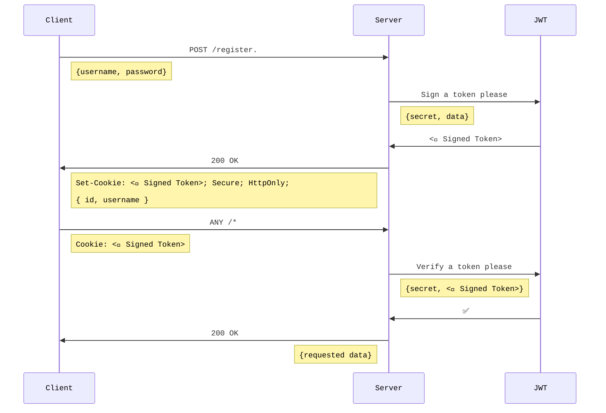

```mermaid
%%{
  init: {
    "fontFamily": "monospace",
    "noteAlign": "left",
    "sequence": {
    }
  }
}%%
sequenceDiagram
  participant C as Client
  participant S as Server
  participant JWT
  C->>S: POST /register.
  Note right of C: {username, password}

  S->>JWT: Sign a token please
  Note right of S: {secret, data}

  JWT->>S: <🔐 Signed Token>

  S->>C: 200 OK
  Note left of S: Set-Cookie: <🔐 Signed Token>#59; Secure#59; HttpOnly#59;<br><br>{ id, username }

  C->>S: ANY /*
  Note right of C: Cookie: <🔐 Signed Token>

  S->>JWT: Verify a token please
  Note right of S: {secret, <🔐 Signed Token>}

  JWT->>S: ✅

  S->>C: 200 OK
  Note left of S: {requested data}
```
